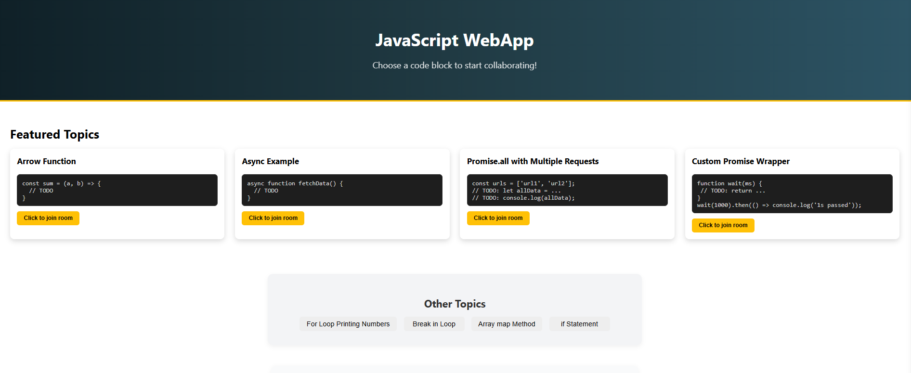
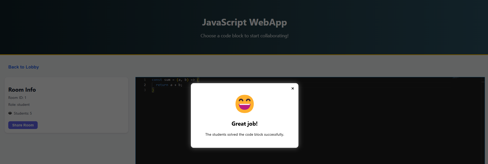

# JSWebApp
A real-time collaborative coding platform for JavaScript students and mentors. Built with **React, FastAPI**, and **SQLite,** this project simulates a coding environment where a mentor and his students can join rooms and solve code blocks together.

## Getting Started

### Live Demo

[Click Here!](https://jswebapp-production.up.railway.app/)

### How to Run Locally
#### 1. Clone the repo
```bash
git clone https://github.com/AlonMesh/JSWebApp.git
cd JSWebApp
```
#### 2. Install backend dependencies

```python
pip install -r requirements.txt
```

#### 3. Start the backend server
```python
uvicorn server.main:app --reload
```
#### 4. In a diffrent terminal, install frontend depeדndencies

```bash
`cd ../client
npm install`
```

#### 5. Start the frontend app

```bash
npm start
``` 

The app will now be available at http://localhost:3000.


## 📄 Features
### Lobby Page
-   List of code blocks (from DB)
-   Choose a block to enter its coding room
-   Add new code blocks via a form
-   Featured and secondary blocks separation



### Code Block Room
-   Mentor is first to join, then 
-   Students see live-updating editor
-   Mentor leaves - Students are redirected to lobby
-   Syntax highlighting with Monaco
-   Real-time collaboration using WebSockets
-   Code matches solution - big smiley popup appears
-   Participants count and role info
-   Reset code button for students & Share room button (copy URL to clipboard)


